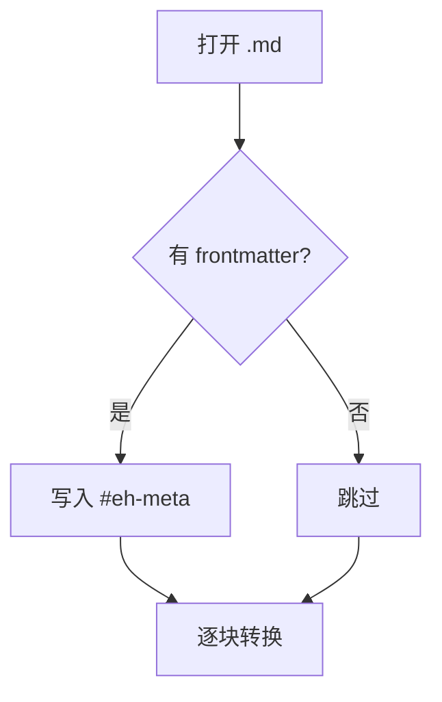
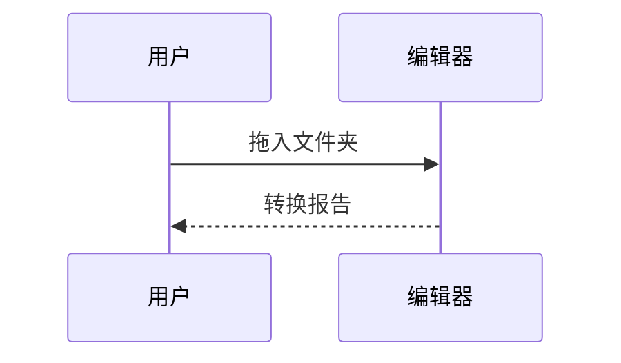

# Diagrams


```mermaid
flowchart TD
    A[打开 .md] --> B{有 frontmatter?}
    B -->|是| C[写入 #eh-meta]
    B -->|否| D[跳过]
    C --> E[逐块转换]
    D --> E
```


```mermaid
sequenceDiagram
    participant U as 用户
    participant E as 编辑器
    U->>E: 拖入文件夹
    E-->>U: 转换报告
```

普通代码块（不是组件）：

```python
def hello():
    print("你好")
```

~~~mermaid
graph LR
    波浪线围栏 --> 也是mermaid
~~~

没有语言的围栏：

```
plain text
```
